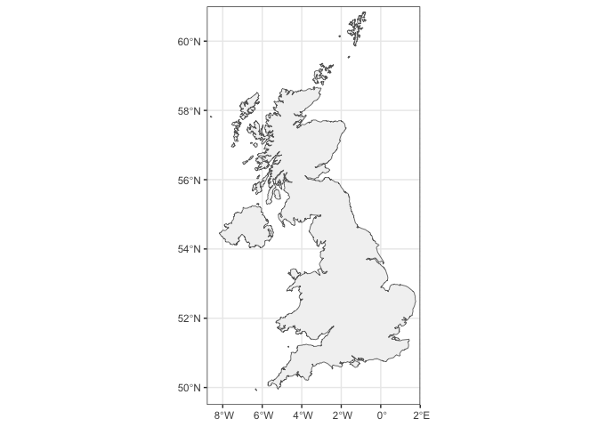
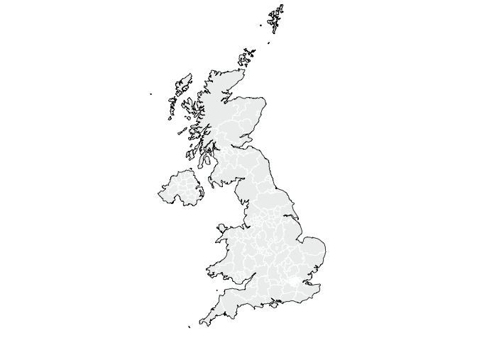
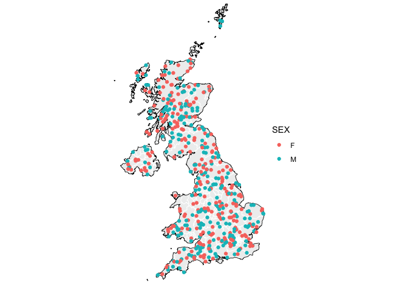
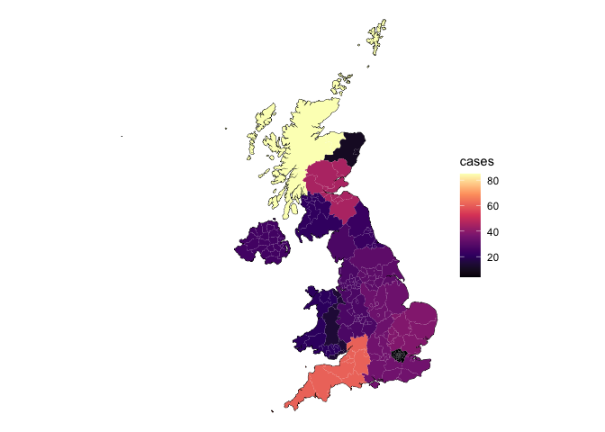

# 5 minutes map


This is a tutorial on how to quickly plot data with geographical
coordinates on a map.

## References

*Drawing beautiful maps programmatically with R, sf and ggplot2:*

https://r-spatial.org/r/2018/10/25/ggplot2-sf.html

https://r-spatial.org/r/2018/10/25/ggplot2-sf-2.html

https://r-spatial.org/r/2018/10/25/ggplot2-sf-3.html

## Libraries

``` r
library(rnaturalearth)
library(sf)
library(dplyr)
library(ggplot2)
```

## Base map

Let’s create a ggplot object using the base map to display the data of
interest.

``` r
uk_map_raw <- ne_countries(
  country = c("United Kingdom"),
  #continent = "Africa",
  scale = "large", #small, medium or large
  returnclass = "sf" #sf or sv
)
```

``` r
library(ggplot2)

uk_map <- ggplot() +
  geom_sf(data = uk_map_raw, 
          fill = "grey95", 
          color = "grey40", 
          linewidth = 0.3
          ) +
  coord_sf( #remove/modify this layer to change the limits of the plot.
    xlim = c(-8.8, 2.0), 
    ylim = c(49.5, 61.0),
    expand = FALSE
  ) +
  theme_bw()

uk_map
```



Adding a ggplot layer showing regional divisions.

``` r
library("maps")

uk_regions <- ne_states(country = "United Kingdom", 
                        returnclass = "sf")
```

``` r
uk_map_region <- ggplot() +
  
  geom_sf(data=uk_regions, 
          fill = "#eeefefff", 
          color = "white", 
          linewidth = 0.3
          )+ 
  
  geom_sf(data = uk_map_raw, 
          fill = NA, 
          color = "black", 
          linewidth = 0.3) +
  
  coord_sf(
    xlim = c(-8.8, 2.0),
    ylim = c(49.5, 61.0),
    expand = FALSE
  )+
  
  theme_void()

uk_map_region
```



## Plotting data

importing the data to be plotted.

``` r
data_ids <- read.csv("~/Desktop/5_minutes_map/data_map.csv")

# checking the class of each column
str(data_ids)
```

    'data.frame':   500 obs. of  7 variables:
     $ ID       : chr  "ID_1" "ID_2" "ID_3" "ID_4" ...
     $ region   : chr  "East Midlands" "Highlands and Islands" "Eastern" "East" ...
     $ postal   : chr  "LI" "WI" "AG" "EX" ...
     $ latitude : num  53.3 58.1 56.7 51.9 53.3 ...
     $ longitude: num  0.108 -6.631 -3.214 1.068 -2.979 ...
     $ AGE      : int  44 73 36 58 97 73 3 87 19 42 ...
     $ SEX      : chr  "F" "F" "M" "M" ...

### Dotplot

Plotting the data, with colours assigned according to the ‘sex’ column.

``` r
uk_map_region +
  geom_point(data = data_ids, 
             aes(x=longitude, 
                 y=latitude, 
                 color=SEX
                 )
             )
```



### Heatmap

``` r
data_ids_heatmap <- as.data.frame(table(data_ids$region))
colnames(data_ids_heatmap) <- c("region", "cases")

data_ids_heatmap <- uk_regions %>%
  left_join(data_ids_heatmap, by = "region")
```

``` r
uk_map_region +
  geom_sf(
    data = data_ids_heatmap,
    aes(fill = cases),
    color = NA,
    linewidth = 0.3
  )+
  scale_fill_viridis_c(
    name = "cases",
    option = "magma"
  )
```


